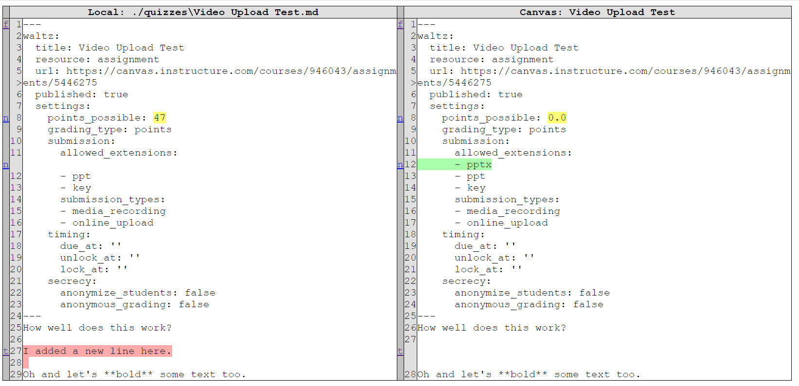

# waltz

A software system for synchronizing curricular materials between a
Learning Management Systems (LMS) and your local filesystem.

Major features include:
* Pull and push data between an LSM and the file system
* Lightweight, friendly Markdown-based format for local resources
* Diffing of local and remote content
* List and search for remote resources

We aim to support the following LMSes:
* Canvas (pages, assignments, quizzes)
* BlockPy (assignment, groups) <- In-progress

# Installation

You can install Waltz from PyPi (the package name is `lms-waltz` even though the module and command line script is `waltz`):

```console
foo@bar:~$ pip install lms-waltz
```

You can also install our dev version from GitHub:

```console
foo@bar:~$ pip install git+https://github.com/acbart/waltz.git
```

## Setup Waltz

Waltz can synchronize content between a local directory and a remote server.
You'll need to initialize the local directory, whether it is empty or already has your learning materials.

```console
foo@bar:~$ waltz init
```

This will create two new files which should both be included in your `.gitignore`:

* `.waltz` is a plain-text YAML file with settings for the current course repository.
* `.waltz.db` is a SQLite database used in file uploading/downloading.

## Setup a Service

Before you can start interacting with an LMS, you'll need to configure an
instance of a service. For example, to configure a new Canvas service, you'll need the following:

1. A short, easy-to-type name for the service instance (e.g., `ud_canvas` or `cs1014_canvas`)
2. [API token](https://community.canvaslms.com/docs/DOC-10806-4214724194)
3. The URL base for your Canvas site (e.g., `https://canvas.instructure.com/`)
4. The Course ID that you want to connect to (usually a large number)

Then, you can use the command below:

```console
foo@bar:~$ waltz configure canvas <name> --base <url> --course <id> --token <token>
```

A more concrete example:

```console
foo@bar:~$ waltz configure canvas ud_canvas --base https://udel.instructure.com/ --course 4234343432343 --token 1081~zJIOJSDFBBSDFIJAIJ==>...
```

If things went well, you can list the available services:

```console
foo@bar:~$ waltz list
The following services are available:
         local:
                 ./
         canvas:
                 ud_canvas
         blockpy: (none configured)
```

By default, there's a Local service for the current directory (representing the connection to the filesystem).
You can have more than one instance of a service, which can allow you to
access multiple data sources from one course (e.g., to transfer resources between semesters).
For convenience, you can refer to the first instance of a service by the service's name.
In our case, anywhere that we use `ud_canvas` we could use `canvas` instead.

## Identifying Resources

You can list available resources for a service:

```console
foo@bar:~$ waltz list <service> <category>
```

So the following code checks the Pages for the Canvas course. Note that
you could use the specific instance name instead of `canvas`, and either
the singular or plural form of `pages`.

```console
foo@bar:~$ waltz list canvas pages
Remote    Local    Title                      Path
--------  -------  -------------------------  --------------------
Yes       Yes      Abstraction                pages\Abstraction.md
Yes       Yes      NetLogo-2                  NetLogo-2.md
Yes       No       Overview of Functions
Yes       No       Syllabus
Yes       No       Themes
Yes       Yes      Turtles                    pages\Turtles.md
```

The `local` service allows you to omit the category (but you can filter by category if you want):

```console
foo@bar:~$ waltz list local

Resource         Title                        Path
---------------  ---------------------------  ---------------------------------------------------------
[unknown]        NetLogo-2                    NetLogo-2.md
[unknown]                                     pages\Abstraction.md
[Page]           Turtles                      pages\Turtles.md
[quiz]           Backup Quiz                  quizzes\Backup Quiz.md
[unknown]                                     quizzes\Mangled Resource.md
[quiz]           New Quiz                     quizzes\New Quiz.md
[assignment]     Video Upload Test            quizzes\Video Upload Test.md
[quiz question]  Complex Matching Question    quizzes\New Quiz Questions\Complex Matching Question.md
[quiz question]  Essay Question               quizzes\New Quiz Questions\Essay Question.md
```

The local service only knows the resource category and title if that information
is available in the front-matter of the Markdown file. Otherwise, it can
only report the path of potential resource files.

Similar to Git, you can use `waltz` commands from child folders and the
system will search up for the configuration and use it appropriately.

## Managing Resources

The two basic commands for moving resources are `pull` and `push`, moving resources between
the local service and a remote one. If the local version does not already exist,
it will be created in the current directory with a filename based on the title of
the resource from the LMS.

```console
foo@bar:~$ waltz pull <service> <category> <title>
foo@bar:~$ waltz push <service> <category> <title>
```

Generally, you want to fully specify the remote service, resource category,
and title of the resource you want to use. This avoids ambiguity.

```
foo@bar:~$ waltz pull canvas assignment "Project 3"
foo@bar:~$ ls
Project 3.md
foo@bar:~$ waltz push canvas assignment "Project 3"
```

However, the commands attempt to work intelligently to find the appropriate file given minimal amounts
of information, particularly for pushing. If the given title matches the title of a file
in the current directory (either based on the filename or the front-matter of the file),
and that file has a resource specified, then the appropriate service can automatically be inferred.

```console
foo@bar:~$ waltz push "Turtles"
```

If the desired files are not in the present folder, it will search subfolders.

TOOD: We are working on ways to further disambiguate resources that have
the same name. This will be accomplished using their IDs or some other attribute.
In general, however, you can avoid ambiguity by organizing the file system
and your LMS resources appropriately.

## Diffing Resources

Pushing and pulling resources can get quite complex, so it can be
helpful to find out how the local version of a resource is different
from the remote. The `diff` command has similar syntax to the other
actions, but does not modify the filesystem when it is run.

```console
foo@bar:~$ waltz diff canvas page "Turtles"
```



By default, `diff`ing will create a new HTML file adjacent to the
resource and automatically open that file in the browser. There is also
simplified console output available.

## Download, Decode, Encode, and Upload

`Pull`ing is actually a two-step process: first you `download` a resource, and then you `decode` it.
Similarly, `Push`ing requires you to `encode` a resource and then `upload` it.

The `upload` and `download` commands (which are available in Waltz) move data between Canvas and the
local Waltz SQLite database. Generally, we download raw data from the remote service (e.g., a JSON blob)
and upload using whatever API is available for the service.

The `encode` and `decode` commands (also available) move data between the local filesystem and the
local Waltz SQLite database. Generally, this means we are decoding the raw data into a Markdown file
or potentially even multiple files.

## Templates

**TODO: This feature is still in progress**

The HTML body of a Resource can be built using a Template. We use the
Jinja2 format to embed data.

## Previewing Resources

**TODO: This feature is still in progress**

If you want to generate a web-friendly local version of a resource, you
can use the `preview` command.

## Building Public Versions

**TODO: This feature is still in progress**

Frequently, you want to create public versions of assignments that are
viewable by folks who are not authorized to see the answers or other
components of a resource. We distinguish between *public* (viewable by
anyone), *private* (viewable by other teachers), and *secret* (viewable
only by local course staff).

You can use the `--hide_answers` flag to remove answers and other
private information from a resource, generating a new file in a parallel
repository.

Secret information usually includes data covered by FERPA, such as
students' grades or assignment submissions. Secret information is harder
to secure in a VCS, but can be done through encryption. In general,
however, data that is meant to be secret should be kept in a different
repository. If you want it alongside the data, though, perhaps we could
encrypt/decrypt the file, suspending git commands until all relevant
files are re-encrypted?

# Terminology

* Resource: A curricular material to be transferred around. Resources can be represented in different styles. Some resources can be composed of other resources.
* Category: Resources of the same type. The "Pages" category is distinct from the "Assignment" category. Categories do not belong to a particular Service, meaning their names must be meaningfully distinct if they are different kinds of things.
* Title: A name that, idealistically, is globally unique within a resource.
* Markdown: A plain-text format that we use to store files locally. Meant to be easily edited. Can have Front-matter.
* Front-matter: At the top of Markdown files, you can put "---" above and below YAML-encoded data to store extra data. We particularly look for a `waltz` attribute with additional Waltz information.

# Service Specific Information

This section details information specific to individual services.

## Local

Waltz is not opinionated about file system organization. You are free to
arrange your data into directories as you see fit. By default, new files
are stored in the current working directory. However, existing files
will be matched as best they can.

Largely, Waltz encourages resources to decode themselves as Markdown
files. In particular, Markdown files with front-matter can be parsed and
have special Waltz-specific information. The only requirement is to have
an attribute named `waltz`. We also strongly encourage a `title` and
`resource` attribute within.

```markdown
---
waltz:
  title: The Resource's Full Proper Name
  resource: Page
---
The body of the file
```

Additional attributes can be stored in the Markdown, and services
attempt to leave them unmangled when downloading updated versions.

## Canvas

Instructure's Canvas has a rich API that allows us to control resources
relatively well.

Code in Markdown files will be syntax-highlighted.

Uploading data into Canvas is somewhat limited. To get around the
limitations, we store additional front-matter as HTML content hidden
inside of an invisible DIV tag at the start of the resource's body. If
that information is deleted on the server, however, there isn't much to
be done to reclaim it. Be careful when deleting large swathes of data if
you are relying on this feature! Also note that we do not currently
encode any extra `waltz` front-matter, so you should be sure not to rely
on extra data stored in that attribute.

You can use the `--all` switch to bulk download resources.

You can use the `--destination <path>` parameter to set the location
where files will be decoded to.

### Canvas Pages

A Canvas Page is decoded into a Markdown file with very minimal
front-matter.

### Canvas Assignments

A Canvas Page is decoded into a Markdown file with very minimal
front-matter.

### Canvas Quizzes

By default, quizzes are pulled as multiple files. The core file will
hold the quiz itself, with the questions stored as a list of their
names. Those questions' content will be then be stored as separate files
in an adjacent folder named `"<Quiz Title> Questions/"`. All question
types are supported.

Groups are also supported, and will be represented inside of the core
Markdown file alongside other questions. However, due to a limitation of
the Canvas API, we are not able to keep the order of grouped questions -
further, we cannot guarantee that question groups will be properly
disposed of. When using quizzes, keep an eye on the Canvas side to make
sure that the content is appropriately transferred.

A Canvas Quiz can be pulled as a combined single file.

```console
foo@bar:~$ waltz pull canvas quiz "My Quiz" --combine 
```

You can specify a question bank to reuse questions between quizzes.

### Canvas Files

**TODO: This feature is still in progress**

You can have either a folder dedicated to being a file system, or
identify an individual file with an adjacent Markdown file.

### Linking Resources

**TODO: This feature is still in progress**

We attempt to decode URLs to images, files, and other resources as
intelligently as possible so that they make sense locally and remotely.

# Full Command List

```console
foo@bar:~$ waltz reset
foo@bar:~$ waltz init
foo@bar:~$ waltz configure <service> <name>
foo@bar:~$ waltz list <service> <category>
foo@bar:~$ waltz pull <service> <category> <title>
foo@bar:~$ waltz push <service> <category> <title>
foo@bar:~$ waltz download <service> <category> <title>
foo@bar:~$ waltz upload <service> <category> <title>
foo@bar:~$ waltz encode <service> <category> <title>
foo@bar:~$ waltz decode <service> <category> <title>
foo@bar:~$ waltz diff <service> <category> <title>
```